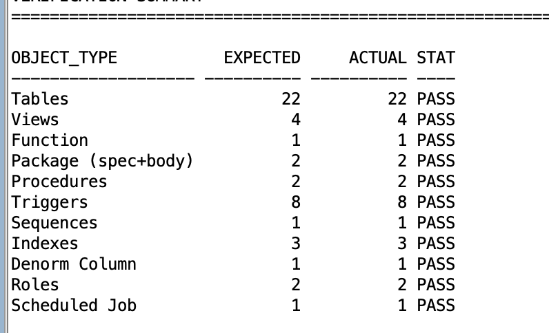

# Adv_DB_Project
Eggshell home builder case

## Entity Description

| Entity                        | ID Range      | Capacity | Example IDs         |
| ----------------------------- | ------------- | -------- | ------------------- |
| **Subdivision**               | `1–2000`      | 2000     | 1, 2, 1999          |
| **Lot**                       | `2001–4000`   | 2000     | 2001, 2100, 3999    |
| **HouseStyle**                | `4001–6000`   | 2000     | 4001, 4101, 5999    |
| **Elevation**                 | `6001–8000`   | 2000     | 6001, 6200, 7999    |
| **House**                     | `8001–10000`  | 2000     | 8001, 8200, 9999    |
| **Housetask**                 | `10001–12000` | 2000     | 10001, 10100, 11999 |
| **Construction Task**         | `12001–14000` | 2000     | 12001, 12500, 13999 |
| **Decorator Session**         | `14001–16000` | 2000     | 14001, 14500, 15999 |
| **Decorator Choice / Option** | `16001–18000` | 2000     | 16001, 16500, 17999 |
| **Task Progress**             | `18001–20000` | 2000     | 18001, 18500, 19999 |
| **Photo**                     | `20001–24000` | 4000     | 20001, 21000, 23999 |
| **Buyer**                     | `24001–26000` | 2000     | 24001–24005         |
| **Employee**                  | `26001–28000` | 2000     | 26001–26003         |
| **Escrow Agent**              | `28001–30000` | 2000     | 28001–28002         |
| **Bank**                      | `30001–32000` | 2000     | 30001               |
| **Bank Worker**               | `32001–34000` | 2000     | 32001–32002         |
| **Sale**                      | `34001–36000` | 2000     | 34001–34005         |

## Execution Steps

This section explains how to deploy and verify the **Eggshell Home Builder Database System** using Oracle SQL Developer.

---

### **STEP 1: Clone the GitHub Repository**

1. Open your terminal or command prompt.
2. Clone the project from GitHub:

   ```bash
   git clone https://github.com/Wescj/Adv_DB_Project.git
   cd Adv_DB_Project
   ```
3. You should now see the project files inside the cloned directory.

---

### **STEP 2: Open and Run the Project in SQL Developer**

1. Launch **Oracle SQL Developer**.
2. Connect to your Oracle Database schema.
3. Open the main deployment script:

   ```
   File → Open → ADV_DB_Project → deploy_eggshell.sql
   ```
4. Execute the script by selecting **Run Script**.

---

### **STEP 3: Deployment Workflow**

The deployment process automatically runs in **three major phases**, as defined in `deploy_eggshell.sql`:

#### **Phase 1 — Cleanup**

* Script: `@cleanup.sql`
* Removes any existing Eggshell objects (tables, views, triggers, etc.) to ensure a clean environment.

#### **Phase 2 — Installation**

* Script: `@master_setup.sql`
* Sequentially executes the following phases:

| Phase | Description                                   | Script(s)                                            |
| :---: | :-------------------------------------------- | :--------------------------------------------------- |
|   1   | Create tables and constraints                 | `@DDL_Script_1.0.ddl`                                |
|   2   | Load initial data                             | `@data_init.sql`                                     |
|   3   | Create views                                  | `@view.sql`, `@view2.sql`                            |
|   4   | Create functions                              | `@function.sql`                                      |
|   5   | Create triggers                               | `@trigger1.sql` to `@trigger4.sql`                   |
|   6   | Implement surrogate keys                      | `@buyer_surrogate.sql`                               |
|   7   | Create packages and procedures                | `@package.sql`, `@procedure1.sql`, `@procedure2.sql` |
|   8   | Create indexes and denormalization structures | `@alternate_index.sql`, `@denormalization.sql`       |
|   9   | Create roles and permissions                  | `@roles.sql`                                         |
|   10  | Create scheduled jobs                         | `@create_sql_script_job.sql`                         |

After the installation is complete, a prompt will appear:

```
PROMPT SETUP COMPLETE – Run verify_eggshell.sql to check installation
```

#### **Phase 3 — Verification**

* Script: `@verify_eggshell.sql`
* Checks that all required database objects are successfully created and that all tasks **PASS**.

---

### **STEP 4: Verify Deployment Results**

After the verification step, you should see an output similar to the following result:



The local execution output is also saved in [**output_deploy_eggshell.txt**](output_deploy_eggshell.txt) for reference and verification.
 for reference and verification.

---

## assumptions to add:
house to elevation relationship issue
id ranges are limited to 2000 each so the numbers are small
why we use photo blob for style

